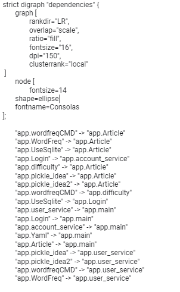
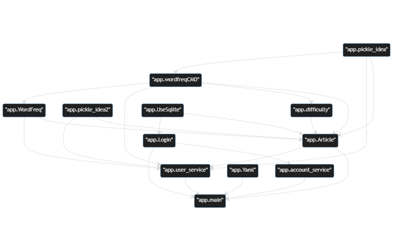
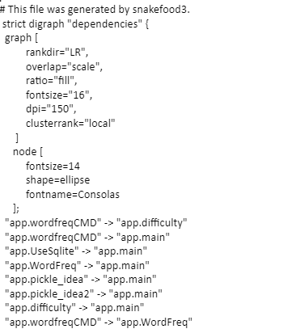
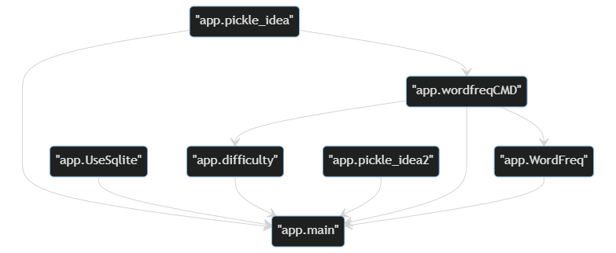
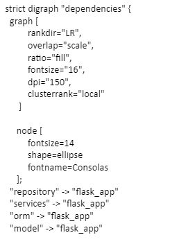

Lab1: Dependency Analysis and Dependency Graphs
=================================================

- Team members

* ALBUKHAITI MOHANAD                                                             201832130106. 
* ALYATIM TALEB ALI                                                              201932130113. 
* ABDULWASEA QASEM MOHAMMED QASEM                                                201932130108. 
* ALQADANI EISSA BANDAR                                                          201836020117. 
* youness elouajri                                                               201832130113. 

24/05/2022

Introduction
------------------------
We must figure out the relationships between modules/classes/functions given the source code of a software application in this lab, as well as analyze the dependencies of the EnglishPal's new architecture(BeginningOfSpring) vs the dependencies of the EnglishPal's old architecture (ColdDew). As a result, we'll compare the two designs above to see which one appears superior.

Materials and Methods
------------------------

* Mermaid to manually draw out function/class dependancy graphs for, both versions of English Pal
* Snakefood: Tool to generate dependencies from Python code, filter, cluster, and generate graphs from a list of dependencies
* Graphviz: Graphviz is an open source graph visualization software. Graph visualization is a way of representing structural information as abstract graphs and network graphs. Graphviz uses a language called DOT to represent graphs. 
* Mermaid: Mermaid is a Javascript-based charting tool. It uses markdown-like text to simplify and speed up the generation of diagrams, flowcharts, and more.

Results
------------------------

EnglishPal（BeginningOfSpring）
~~~~~~~~~~~~~~~~~~~~~~~~~~~~~~~~

* App.dot:

* Image:

EnglishPal（ColdDew）
~~~~~~~~~~~~~~~~~~~~~~~~~~~~~~~~

* App.dot:

* Image:

 Chapter4_code
~~~~~~~~~~~~~~~~~~~~~~~~~~~~~~~~

* App.dot:

* Image:

Discussions
------------------------
* How would you rate the architectural health of each edition of EnglishPal on a scale of 1 to 5 (worst to best)? Which version of EnglishPal is the most straightforward to use and maintain? In no more than three sentences 
The answer.
In comparison to the latter, The Beginning of Spring is easier to grasp since it has a higher degree of abstraction and appears neater. It also contains a service layer, which offers a number of advantages, such as capturing all of the application's use cases.

Table 1: Comparing five aspects between the two versions of EnglishPal, ColdDew and BeginningOfSpring.

+---------------------------------------------------------+-------------+-----------------------+
|                                                         | **ColdDew** | **BeginningOfSpring** |
+=========================================================+=============+=======================+
|    Lines of code in main.py (excluding blank lines)     |     104     |          70           |
+---------------------------------------------------------+-------------+-----------------------+
|        Number of HTML files in folder templates         |      3      |          10           |
+---------------------------------------------------------+-------------+-----------------------+
|         Has a service layer? Answer Yes or No.          |      No     |          Yes          |
+---------------------------------------------------------+-------------+-----------------------+
| Front-end and back-end coupling. Answer Strong or Weak. |    Strong   |         Weak          |
+---------------------------------------------------------+-------------+-----------------------+
|           Number of module-level dependencies           |      15     |          21           |
+---------------------------------------------------------+-------------+-----------------------+

References
------------------------
http://121.4.94.30:3000/mrlan/EnglishPal.git

`Mermaid <https://mermaid-js.github.io/mermaid-live-editor/edit>`_

