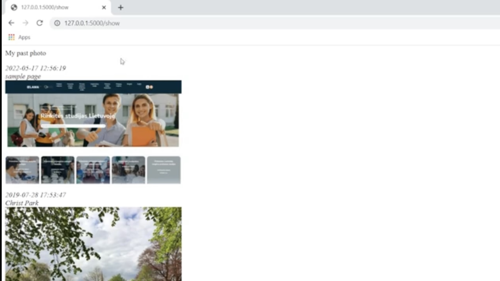
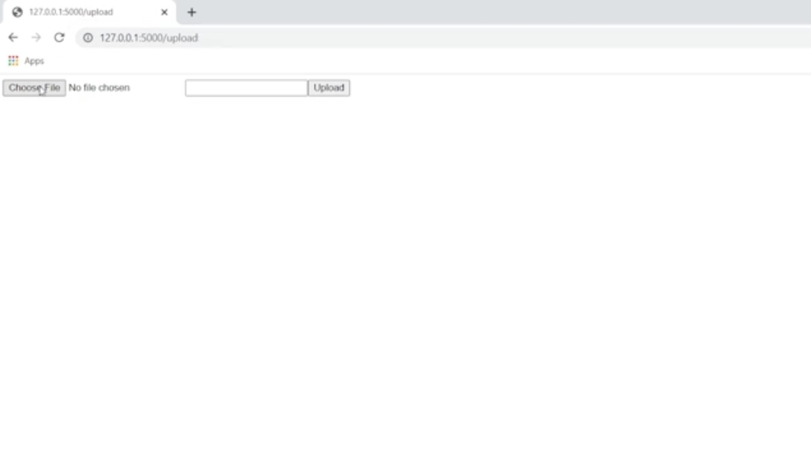
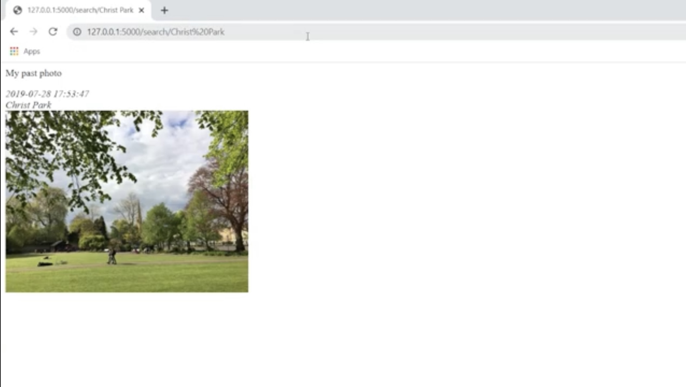
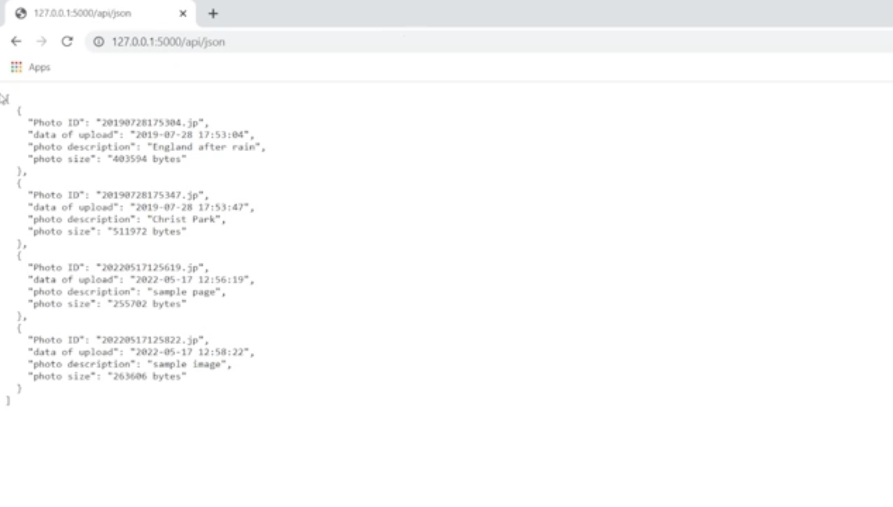

Using Blueprints to Architect A Photo Album Web Application
=================================================

- Team members

* ALBUKHAITI MOHANAD                                                             201832130106. 
* ALYATIM TALEB ALI                                                              201932130113. 
* ABDULWASEA QASEM MOHAMMED QASEM                                                201932130108. 
* ALQADANI EISSA BANDAR                                                          201836020117. 
* youness elouajri                                                               201832130113. 

- A link to demo video
https://cloud.zjnu.edu.cn/share/17c3cb4c198094a94476055811

- A zip file of the source code without pictures.
https://cloud.zjnu.edu.cn/share/4fa0f2dfd045764f26e99bb09f

- source code project
https://github.com/mohanadrashad/photo-project.git

24/05/2022

Abstract
------------------------
This is a practical application of how to use blueprints to organize a Flask web application
I'm going to show you how we can divide things up with blueprints how we can create kind of our own little mini apps inside of the big web application

Introduction
------------------------
We will talk about blueprints which essentially allows us allows us to divide up our application into separate Python files where we can actually pass specific views and render templates from different areas of our kind of project our application now this is really nice because sometimes you might create let's say maybe like an admin page or specific login script or something that you could reuse in different applications well with our previous knowledge we would have had to put all of that in the same Python file which would make it much more difficult to reuse those different components in new flask applications so here I'm gonna show you how we can divide things up with blueprints how we can create kind of our own little mini-apps inside of the big web application and then how we kind of reference those and use those properly 

Materials and Methods
------------------------
We worked on a Photo String Web Application for storing photos we make the functions and the page easier to reuse in different applications.
We worked as a team and each person tried to fixed the problems he faced, we learned how to dealt with python and flask using blueprint to organization. 
- We add a few  features
* A new photo can be uploaded using the upload bp blueprint. /upload is the corresponding path.
* The show bp blueprint lets you to see all of your photographs and descriptions. The corresponding route is /show.
* The search bp blueprint allows filtering photos according to their descriptions, The associated route is /search/query-string. Only the photos whose descriptions match  
* The api bp blueprint enables command-line access to all photo information in JSON format. HTTPie is a good tool for testing APIs. /api/json is the corresponding route. For each photo, the returned json string must include the photo ID, date of upload, photo size (in KB), and photo description.

Results
------------------------
* show

* Upload

* Search

* Api jison

Discussions
------------------------
This project is a demonstration of  how to use blueprint to organization. , but it still lacks a lot of capabilities that may be added in the future. However, it has taught me how we can divide things up with blueprints how we can create kind of our own little mini-apps inside of the big web application and then how we kind of reference those and use those properly 
This program may be modified to include a more current interface and designs, as well as additional functionality .

References
------------------------
1. Blue prints in Flask
https://youtu.be/WteIH6J9v64

2. Sql lite database with Flask
https://flask.palletsprojects.com/en/2.1.x/patterns/sqlite3/

3. Api develpoment using flask
https://nordicapis.com/how-to-create-an-api-using-the-flask-framework/

- A link to demo video
https://cloud.zjnu.edu.cn/share/17c3cb4c198094a94476055811

- A zip file of the source code without pictures.
https://cloud.zjnu.edu.cn/share/4fa0f2dfd045764f26e99bb09f

- source code project
https://github.com/mohanadrashad/photo-project.git

